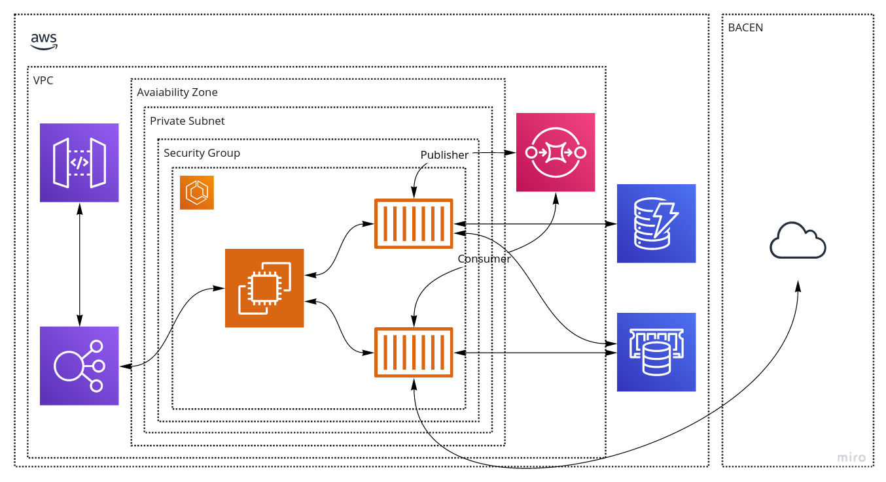

# cortex
Cortex

## Arquitetura



## DynamoDB

Execução de instância local do DynamoDB:

```
cd resources/dynamodb
./start.sh
```

## Configurações da IDE

### VM options

Configuração de perfil local:

```
-Dspring.profiles.active=local
```
